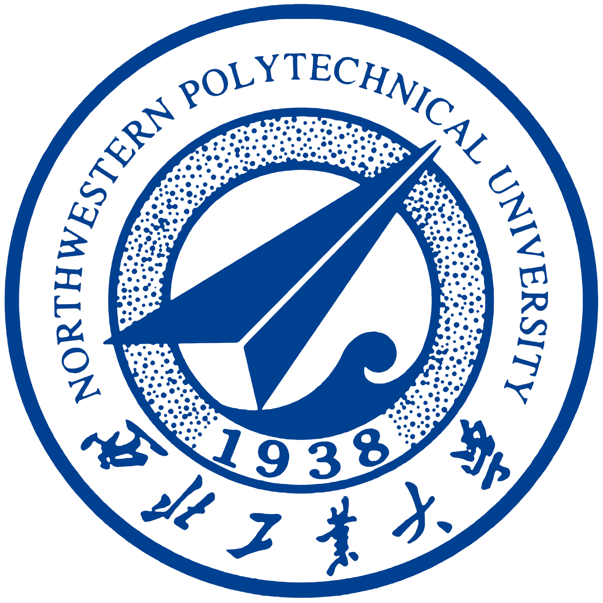

I am Shipeng Chen (陈诗鹏 in Chinese), an undergraduate student majoring in Computer Science at Northwestern Polytechnical University (NWPU). I am expected to graduate in 2026. My research interests primarily focus on Machine Learning Systems, with a particular emphasis on efficient machine learning techniques. I am deeply interested in LLM quantization and acceleration methods to improve the efficiency and deployment of large language models.

My academic journey is driven by a passion for developing systems that can make advanced AI models more accessible and practical for real-world applications. I believe that by optimizing these models, we can bridge the gap between cutting-edge research and widespread adoption.

Feel free to contact me at [imchensp@gmail.com](mailto:imchensp@gmail.com) if you'd like to discuss research opportunities or collaboration in these areas!

## Research Interests

* Machine Learning Systems (MLSys)
* Efficient Machine Learning
* LLM Quantization and Acceleration
* Deep Learning Optimization

## Education

  

    
  

  

    <h3>Northwestern Polytechnical University (NWPU)</h3>
    
B.Eng. in Computer Science, 2022 - 2026 (expected)

  

## Experiences

  

    
  

  

    <h3>University of Alberta</h3>
    
Research Intern, 2024.7 - 2024.9

    
Worked on 3D vision research focused on semantic analysis and recognition of traffic road point clouds, and generating textual descriptions of the scenes.

  

## Skills

* **Programming Languages**: Python, C/C++, CUDA
* **Frameworks**: PyTorch
* **Tools**: Git, Docker, Linux

